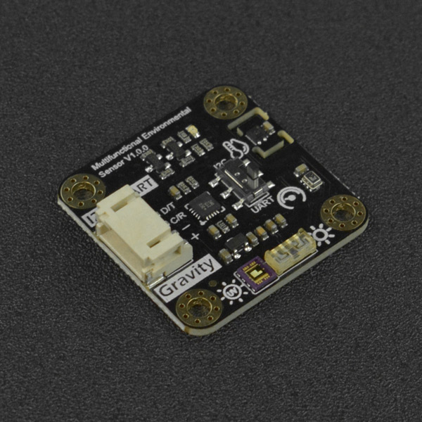

DFRobot_EnvironmentalSensor
===========================

- [中文版](./README_CN.md)

The multifunctional environmental sensor(SEN0500/SEN0501) integrates the UV, illumination, atmospheric pressure and temperature and humidity detection functions into one. It features Gravity and Breakout interfaces, and supports UART and I2C data communication, which can be selected by the onboard switch. <br/>
This Arduino Library developed by DFRobot is specially designed for DFRobot Environmental sensor. Users can use the library to drive their sensor to obtain relevant environmental data conbining with an Arduino mainboard. 




## Product Link (https://www.dfrobot.com)

    SKU：SEN0500/SEN0501

## Table of Contents

  * [summary](#summary)
  * [installation](#installation)
  * [methods](#methods)
  * [compatibility](#compatibility)
  * [history](#history)
  * [credits](#credits)

## Summary

This multifunctional environmental sensor library can help obtain information like temperature, humidity, pressure, UV intensity, natural sunlight intensity and altitude.
The module also offers Gravity and breakout version for easy use.

## Installation

Download this library to Raspberry Pi before use, then open the routine folder. Type python demox.py on the command line to execute a routine demox.py. For example, to execute the control_led.py routine, you need to enter:

```python
python control_led.py
```

## Methods

```python
  '''!
    @brief Init SEN0500/SEN0501 sensor
    @brief Init SEN0500/SEN0501 sensor
    @return Return init status
    @retval 0  Succeed
    @retval -1 Failed
  '''
  def begin(self):

  '''!
    @brief Get SEN0500/SEN0501 temperature data
    @param units Temperature data unit select
    @n     TEMP_C ℃
    @n     TEMP_F ℉ 
    @return Return the obtained temperature data
  '''
  def get_temperature(self,unist):

  '''!
    @brief Get SEN0500/SEN0501 humidity data 
    @return Return the obtained humidity data
  '''
  def get_humidity(self):

  '''!
    @brief Get SEN0500/SEN0501 UV intensity index data 
    @return Return the obtained UV intensity index data
  '''
  def get_ultraviolet_intensity(self):

  '''!
    @brief Get SEN0500/SEN0501 luminous intensity data 
    @return Return the obtained luminous intensity data
  '''
  def get_luminousintensity(self):

  '''!
    @brief Get SEN0500/SEN0501 atmosphere pressure data 
    @param units Atmosphere pressure data unit select
    @n            HPA Hectopascal
    @n            KPA Kilopascal
    @return Return the obtained atmosphere pressure data
  '''
  def get_atmosphere_pressure(self, units):

  '''!
    @brief Get SEN0500/SEN0501 altitude data 
    @return Return the obtained altitude data
  '''
  def get_elevation(self):
```

## Compatibility

* RaspberryPi Version

| Board        | Work Well | Work Wrong | Untested | Remarks |
| ------------ | :-------: | :--------: | :------: | ------- |
| Raspberry Pi2 |           |            |    √     |         |
| Raspberry Pi3 |           |            |    √     |         |
| Raspberry Pi4 |       √   |            |          |         |

* Python Version

| Python  | Work Well | Work Wrong | Untested | Remarks |
| ------- | :-------: | :--------: | :------: | ------- |
| Python2 |     √     |            |          |         |
| Python3 |     √     |            |          |         |

## History

- 2021-08-31 - Version 1.0.0 released.

## Credits

Written by TangJie(jie.tang@dfrobot.com), 2021. (Welcome to our [website](https://www.dfrobot.com/))
